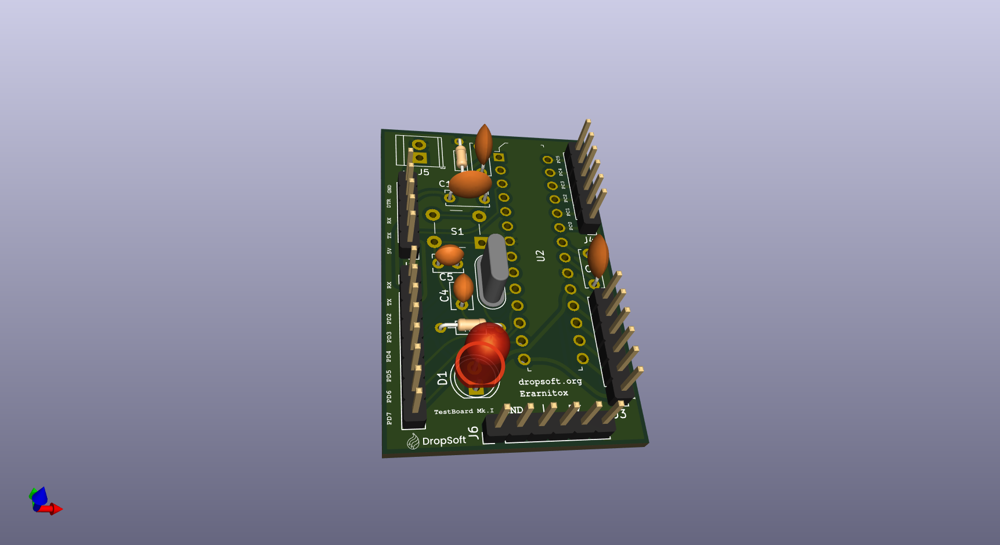

# Arduino Clone

This project is a simple arduino UNO clone project.
It aims to be a template to to start with to create a production ready PCB
for your arduino projects.

This project only uses trough hole technology components so it should be quite
easy to assemble for hobbyists (like myself).

Please note that this really only should aid as a starting point for your final PCB.
This is how the board currently looks like:

